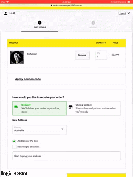
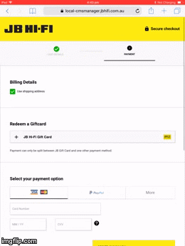
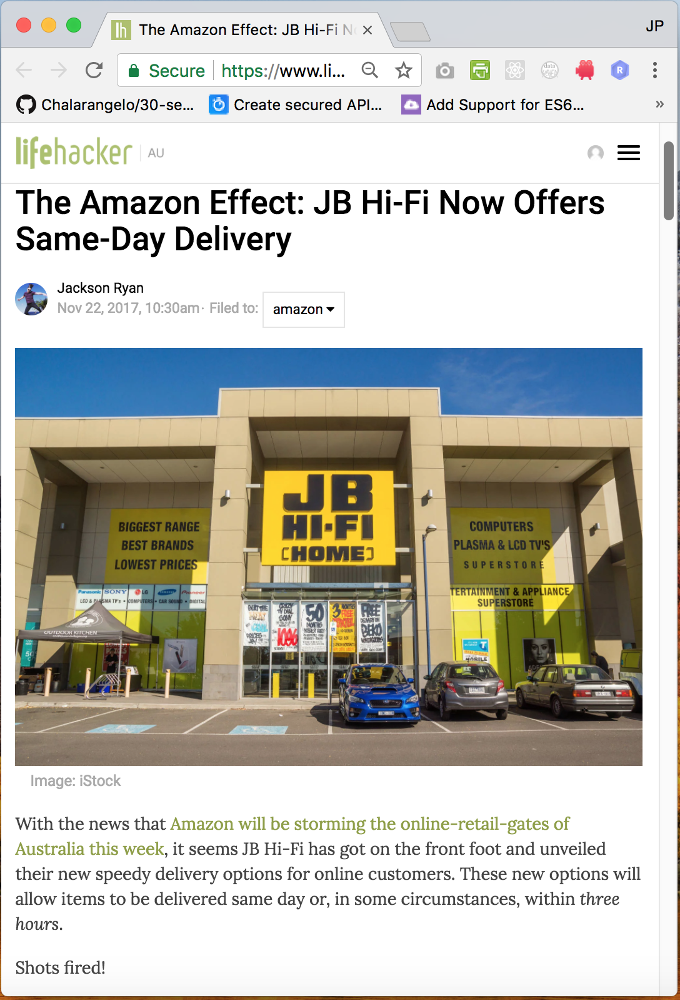

jp.hunter@aol.com ~ [Github](https://www.github.com/JPHUNTER "Github - JPHUNTER") ~ [LinkedIn](https://www.linkedin.com/in/john-paul-hunter "LinkedIn - JPHUNTER") 

    

       

            
<strong>Software Engineer </strong>Front End specialist.

       

    

# Relevant experience

## JB Hi-Fi
#### www.jbhifi.com.au
#### Software Engineer (March 2015 – present)
**Tech Stack:** JavaScript, jQuery, AJAX, NodeJS, React, Relay, GraphQL, Ruby, WebdriverIO, Mocha, Chai, Enzyme, Sinon (and I've even dabbled in C# .NET and Azure Functions)

JB Hi-Fi is an Australian retailer of consumer electronics, as well as a supplier of video games and of Blu-rays, DVDs, and CDs. It is a chain store operation headquartered in Melbourne.
 #### Key Responsibilities and Contributions
 
* Developing, supporting and maintaining the JB Hi-Fi Retail Website www.jbhifi.com.au
* Programming the core online stack in C#, .NET, AngularJS and jQuery
* Successfully implemented a new decoupled front end stack using React, Webpack, Mocha, Chai and Enzyme to provide a whole new range of delivery options and payment options to JB Hi-fi's enormous customer base, so check it out!

  
  

* By the way, you can read up on this massive success over at Lifehacker:
https://www.lifehacker.com.au/2017/11/the-amazon-effect-jb-hi-fi-now-offers-same-day-delivery/

#### Additional Responsibilities and Contributions
* Worked as a part of a multi-disciplinary team in a fast-paced Agile development environment
* liaised with key stake holders and project owners to determine requirements and scope of works
* responsible for the front-end architecture, pull request reviews, post-merge deployments, and releases

## Colorado (Fusion Retail Brands)
#### www.colorado.com.au
#### Web Developer (2012 to 2015)
**Tech Stack:** JavaScript, jQuery, SASS, SQL and some development with ASP VB .Net
#### Key Responsibilities and Contributions:
* JavaScript (jQuery) and VB .Net Development of www.colorado.com.au. 

#### Additional Responsibilities and Contributions
* Developed a jQuery mobile driven Colorado web store
* development and support of proprietary middleware messaging broker system.

## JAG (Fusion Retail Brands)
#### www.jag.com.au
#### Web Developer (2012 to 2015)
**Tech Stack:** JavaScript, jQuery, SASS, SQL and some development with ASP VB .Net.
#### Key Responsibilities and Contributions:
* JavaScript (jQuery) and VB .Net Development of www.jag.com.au.

## Betstar
#### www.betstar.com.au
#### Web Developer (2010 to 2012)
**Tech Stack:** HTML5, CSS3, JavaScript, jQuery, .NET, SQL
#### Key Responsibilities and Contributions:
* Development and support of requirements across all wagering and web applications.
www.betstar.com.au.

#### Additional Responsibilities and Contributions
* Supported and enhanced proprietary web based wagering applications and websites
* participated with business management in determining the online strategic directions of the business.

## Hobsons
#### www.hobsons.com.au
#### Web Application Developer (2008 to 2010)
**Tech Stack:** HTML, CSS, JavaScript, .NET, SQL, SSRS, XML
#### Key Responsibilities and Contributions:
* Responsible for web development and online support
* ensured the quality and effectiveness of online and campaign work though appropriate processes and checks
* researched and administered online solutions to support business initiatives and responsible for maintaining these solutions.

## Communications Management
#### Web Application Developer (2004 to 2008)
**Tech Stack:** HTML, CSS, JavaScript, Classic ASP (VBScript), SQL, SQL Server, DTS, SSIS, SSRS, FoxPro,
#### Key Responsibilities and Contributions:
* Full programming and design solutions provided to custom build proprietary web systems according to multiple and differing client specific requirements
* evaluated, audited and analysed the business and user needs to specify what were to be included in the interactive systems and identify how the information was to be organised
* supported corporate infrastructures including Exchange, file and SQL Servers, network printers, firewalls, antivirus and any and all other related systems.

## Astor Hostels – London
#### Web Master (2002 to 2004)
**Tech Stack:** HTML, CSS, JavaScript, Classic ASP (VBScript), SQL,
www.astorhostels.co.uk

#### Key Responsibilities and Contributions:
*	Development and support of HTML and JavaScript based web sites
*	implemented a new booking engine to handle the hostels beds
*	implemented a state of the art CCTV system with web streaming capabilities.

## Impressions
#### IT Manager (2001 to 2002)
**Tech Stack:** HTML, CSS, JavaScript, Classic ASP, SQL Server, FoxPro
#### Key Responsibilities and Contributions:
* Managed the IT department, motivate staff, and effectively communicate plans projects and projects through to upper management.
 
## M+K Solicitors
#### Systems and Networks Administrator (1998 to 2001)
#### Key Responsibilities and Contributions:
*	Responsible for the maintenance and upkeep of a 250+ user environment, providing helpdesk and network support
*	supported corporate infrastructures Exchange, file and SQL Servers, network printers, firewalls, antivirus and any and all other related systems.

# More about me
## Education
Swinburne University of Technology

Master of Multimedia(MMm) with a major in Computer Engineering

Completed in 2012
## Web Development
I'm an experienced Creative Technologist and have built and shipped apps using node, JavaScript and .NET and SQL Postgres, using queues, caching, continuous integration etc. I might even know some CSS.
## Side projects
When I'm not working on the internet, I love to delve into the obscure and long-forgotten. More recently been delving into the realm of Atari 2600 and Atari Lynx games programming using C++, Assembly code and the CC65 (Cc65 is a compiler for the 6502 which is the processor of the Atari Lynx.) 
If youre interested in reading about my adventures, You ought to check out my blog @
[Guzzolene](https://www.guzzolene.com "Guzzolene")

This site is built with [Gatsby.js](https://github.com/gatsbyjs/gatsby "Gatsby.js") and [Typography.js](https://kyleamathews.github.io/typography.js/ "Typography.js")