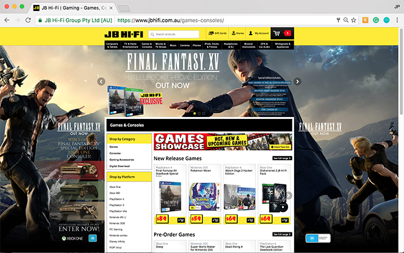

jp.hunter@aol.com ~ [Github](https://www.github.com/JPHUNTER "Github - JPHUNTER") ~ [LinkedIn](https://www.linkedin.com/in/john-paul-hunter "LinkedIn - JPHUNTER") 

    

       

            
<strong>A Senior Front-end Web Developer</strong> passionate about creating digital experiences.

       

    

    

       

           
       

    

I am an expert in front end technologies, processes and tools. I thoroughly enjoy designing and building new capabilities relating to online systems.

I have in-depth understanding of agile and waterfall software development life cycles as well as object-oriented design principles and patterns. My team members look to me for thought and project leadership in the context of software development.

# Relevant experience

## JB Hi-Fi
#### www.jbhifi.com.au
#### Web Developer (March 2015 – present)

JB Hi-Fi is an Australian retailer of consumer electronics, as well as a supplier of video games and of Blu-rays, DVDs, and CDs. It is a chain store operation headquartered in Melbourne.

**Technologies:** React, Redux, Flux, Relay, GraphQL, PostgreSQL, Postgrpahql, JavaScript, jQuery, AngularJS, SASS, SQL

#### Selected Responsibilities and Contributions
Wrote JavaScript/AngularJS, HTML5, and CSS3/Sass and performed unit testing for new features on a successful rebranding project
* built a Mission Control system Integrated with React, Relay, GraphQL, PostgreSQL, Postgraphql, Express, ES6/ES7, JSX, Webpack, Babel, Material Design Lite, and PostCSS
* JavaScript (jQuery and Angular) Development of the JB Hi-Fi Retail Website www.jbhifi.com.au
* developed a new jQuery and Bootstrap integrated JB Hi-Fi Solutions Site www.jbhifi.com.au/solutions
* worked as a part of a Multi-Disciplinary team in a fast-paced Agile development environment
* liaised with key stake holders and project owners to determine requirements and scope of works
* introduced the Airbnb JavaScript Style Guide for all JB Hi-Fi Online front-end development, 
giving JB Hi-Fi a standard by which to produce JavaScript.
* created new features, to make updates to existing features using AngularJS, and to consume JSON microservices in an Agile environment. Responsible for the front-end architecture, pull request reviews, post-merge deployments, and releases
Wrote JavaScript/AngularJS, HTML5, and CSS3/Sass 
* implemented automated functional unit tests for new features on the online webstore using Horseman, PhantomJS, mocha and chai

## Colorado
#### www.colorado.com.au
#### Web Developer  
#### 2012 to 2015

**Technologies:** JavaScript, jQuery, SASS, SQL and some development with ASP C# .Net
#### Selected Responsibilities and Contributions:
* JavaScript (jQuery) and VB .Net Development of www.colorado.com.au 
* development and support of proprietary middleware messaging broker system
* developed a new jQuery mobile driven Colorado web store www.colorado.com.au
* worked as a part of a Multi-Disciplinary team across many differing development projects

## JAG
#### www.jag.com.au
#### Web Developer  
#### 2012 to 2015
**Technologies:** JavaScript, jQuery, SASS, SQL and some development with ASP C# .Net
#### Selected Responsibilities and Contributions:
* JavaScript (jQuery) and VB .Net Development of www.jag.com.au
* development and support of proprietary middleware messaging broker system
* developed a new jQuery mobile driven Jag web store www.jag.com.au
* worked as a part of a Multi-Disciplinary team across many differing development projects

## Betstar

#### www.betstar.com.au
#### Web Developer  
#### 2010 to 2012
**Technologies:** HTML5, CSS3, JavaScript, jQuery, .NET, SQL
#### Selected Responsibilities and Contributions:
* supported and enhanced proprietary web based wagering applications and websites, see www.betstar.com.au
* development and support of requirements across all wagering and web applications.
* participated with business management in determining the online strategic directions of the business.

# Web

I'm an experienced Front-end Web Developer, and have built and shipped apps using .NET, JavaScript and Postgres, using queues, caching, continuous integration etc. I even know some CSS.

# More about me

## Education

Master of Multimedia(MMm) majoring in Computer Engineering.

# Side projects

When I'm not working I like to make things on the internet.

[Guzzolene](https://www.guzzolene.com "Guzzolene")

This site is built with Gatsby.js and Typography.js - thanks @kylemathews