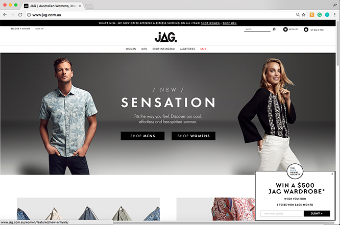
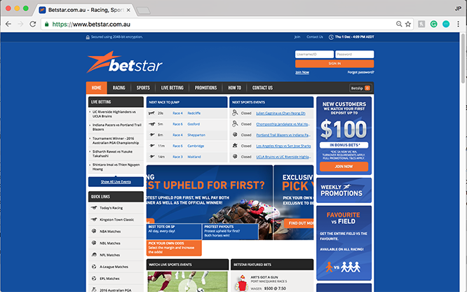

jp.hunter@aol.com ~ [Github](https://www.github.com/JPHUNTER "Github - JPHUNTER") ~ [LinkedIn](https://www.linkedin.com/in/john-paul-hunter "LinkedIn - JPHUNTER") 

    

       

            
A software engineer with a demonstrated history of working in the web development industry.

       

    

# Relevant experience

## JB Hi-Fi
#### www.jbhifi.com.au
#### Front-end Developer (March 2015 – present)

JB Hi-Fi is an Australian retailer of consumer electronics, as well as a supplier of video games and of Blu-rays, DVDs, and CDs. It is a chain store operation headquartered in Melbourne.
 
 #### Key Responsibilities and Contributions
*Successfully delivered a new decoupled front end stack for the JB Hi-Fi retail website using a React to provide a new range of delivery and payment options to delight customers. Check out the Lifehacker review at: https://www.lifehacker.com.au/2017/11/the-amazon-effect-jb-hi-fi-now-offers-same-day-delivery/

* worked as a part of a multi-disciplinary team in a fast-paced Agile development environment
* worked with key stake holders and project owners to determine requirements and scope of work
* responsible for the front-end architecture, pull request reviews, post-merge deployments, and releases

  
  

## Colorado (Fusion Retail Brands)
#### www.colorado.com.au
#### Web Developer (2012 to 2015)
#### Key Responsibilities and Contributions:
* JavaScript and VB .Net Development of http://www.colorado.com.au
* delivered a jQuery-mobile driven Colorado web store
* development and support of proprietary middleware messaging broker system

## JAG (Fusion Retail Brands)
#### www.jag.com.au
#### Web Developer (2012 to 2015)
#### Key Responsibilities and Contributions:
* JavaScript and VB .Net Development of http://www.jag.com.au

## Betstar
#### www.betstar.com.au
#### Web Developer (2010 to 2012)
#### Key Responsibilities and Contributions:
* Development and support of requirements across all wagering and web applications http://www.betstar.com.au
* supported and enhanced proprietary web based wagering applications and websites
* participated with management in determining the online strategic direction of the business.

## Hobsons
#### www.hobsons.com.au
#### Web Application Developer (2008 to 2010)
#### Key Responsibilities and Contributions:
* Delivered a custom online reporting portal using SSRS and SSIS to deliver reporting capabilities to the business
* Development and delivery of custom web applications
* Provided online solutions to support business initiatives

## Communications Management
#### Web Application Developer (2004 to 2008)
#### Key Responsibilities and Contributions:
* Full programming and design solutions provided to custom build proprietary web systems according to multiple and differing client specific requirements
* evaluated, audited and analysed the business and user needs to specify what were to be included in the interactive systems and identify how the information was to be organised
* supported corporate infrastructures including Exchange, file and SQL Servers, network printers, firewalls, antivirus and any and all other related systems

## Astor Hostels – London
#### Web Master (2002 to 2004)
#### www.astorhostels.co.uk
#### Key Responsibilities and Contributions:
* Development and support of all  web sites
* implemented a new booking engine
* implemented a state of the art CCTV system with web streaming capabilities

## Impressions
#### IT Manager (2001 to 2002)
#### Key Responsibilities and Contributions:
* Managed the organisations IT requirements  and effectively communicate plans projects and projects through to upper management.
 
## M+K Solicitors
#### Systems and Networks Administrator (1998 to 2001)
#### Key Responsibilities and Contributions:
* Responsible for the maintenance and upkeep of a 250+ user environment, providing helpdesk and network support
* supported corporate infrastructures Exchange, file and SQL Servers, network printers, firewalls, antivirus and any and all other related systems

# More about me
## Education
Swinburne University of Technology

Master of Multimedia(MMm) with a major in Computer Engineering

Completed in 2012
## Software Enineering
I'm an experienced Software Engineer and I love to build and ship apps using Node, JavaScript, VB, C#, .NET, SQL, Databases and Web Services. I've also worked with AWS Lambda and Azure Functions.

## Hobbies and Interests
* Coding / Programming – I have strong analytical skills and the desire to learn. I am fortunate in that I’ve successfully transformed this hobby into my professional career. If you're interested in reading about some of my more recent projects check out my coding blog at [Guzzolene](https://www.guzzolene.com "Guzzolene") or, for a more comprehensive view, check out my GitHub profile at https://github.com/jphunter [JPHUNTER](https://github.com/jphunter  "JPHUNTER")
* Amateur Photography – I’m artistic and patient. I love hitting the streets with my Nikon in hand waiting to snap the perfect shot
* Travelling – Visiting different countries and exploring the world has given me valuable life experience. I have gained an appreciation for other cultures and it has helped broaden my horizons
* Hiking – one of my favorite outdoor activities. It helps to keep me focused and to keep a clear head

This site is built with [Gatsby.js](https://github.com/gatsbyjs/gatsby "Gatsby.js") and [Typography.js](https://kyleamathews.github.io/typography.js/ "Typography.js")